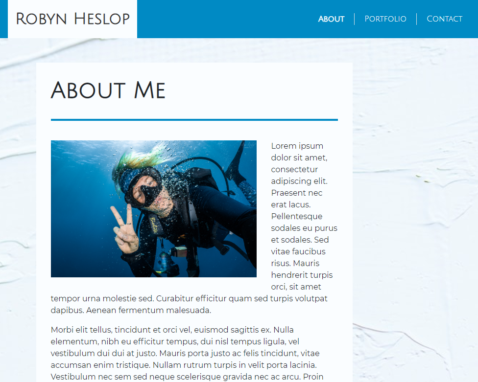
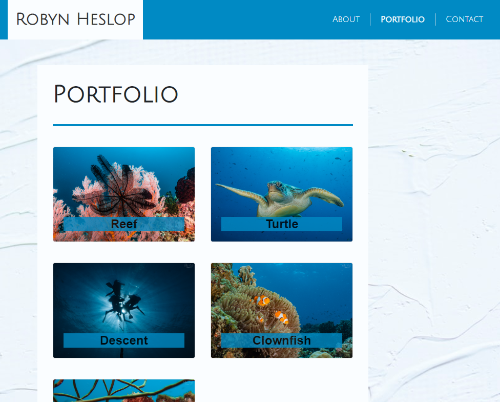
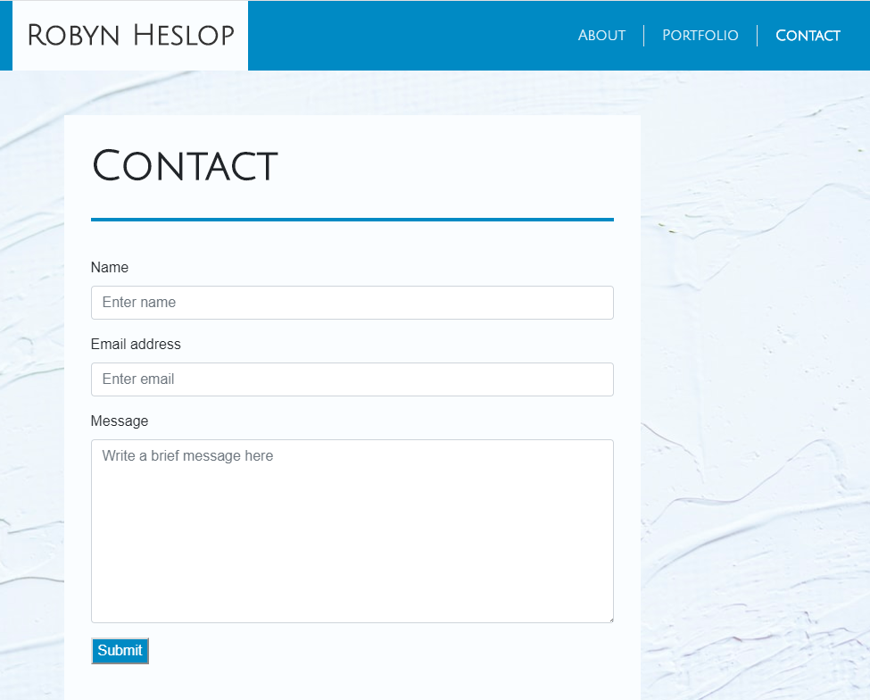

## Welcome to my Portfolio

You can find the deployed website here: 
https://robynheslop.github.io/Media_Responsive_Portfolio/

Media responsiveness across 640px, 768px and 980px viewports

#### Features include:

* A navbar
* A responsive layout
* Responsive images
* Sticky footer

This website is made up of three pages. The portfolio page holds a variety of underwater images in a responsive layout. A contact form allows a visitor to leave their name, email and a brief message. The home page is lorem ipsum text wrapping around another image. Links to each page are found in the navbar at top of the page. 

HTML Validated with https://www.freeformatter.com/

Sample index page 

Sample portfolio page 

Sample contact page 

